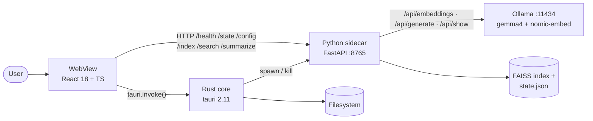
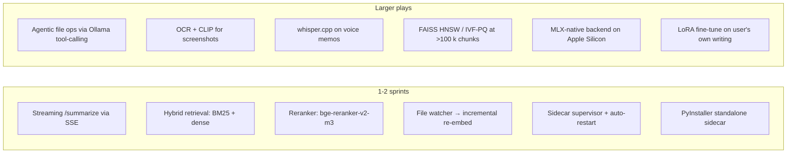

# Rover — Technical Report

**Project:** Rover · 100% offline AI Finder for macOS · GDG AI Hack Milano 2026 — "Cut the Cord"
**Branch:** `mvp-finder` @ `86efd5a` · **Date:** 2026-05-09

## 1. Architecture

Three processes, two IPC channels, one local LLM. The WebView is unprivileged; Rust owns file mutations; Python owns embeddings, FAISS, and LLM calls. `scripts/airplane-check.sh` greps the source for non-localhost URLs to enforce the offline contract.

| Layer | Stack | LOC | Job |
|---|---|---|---|
| Frontend | React 18 / TS / Vite / Tailwind layout-only | ~1.8 k | UI, no privileges |
| Rust core | Tauri 2.11, 9 commands | ~570 | Native dialogs, `fs::rename`, sidecar lifecycle |
| Python sidecar | FastAPI / FAISS / pypdf / tiktoken | ~430 | Walk → parse → chunk → embed → store; LLM prompts |
| Models | gemma4:latest (gen) · nomic-embed-text (768-d) | 3.6 GB | Local via Ollama |
| Bundle | ~20 MB binary + 150 MB venv | – | Single `.app` |

**Indexing.** `os.walk` + prune excluded dirs → parse (pdf/docx/md/txt) → chunk (`tiktoken cl100k_base`, 512 tok / 64 overlap) → `embed_batch` with `search_document:` prefix → L2-normalize → `FAISS IndexFlatIP.add` → persist. Cap: 3 000 files.
**Search.** Embed query with `search_query:` prefix → top-k inner product → render with `<mark>` highlights.
**Summarize.** Parse(path)[:8000] → gemma4 with `temperature=0.3, num_ctx=4096, think=false` → markdown bullets.

## 2. Recent decisions worth flagging

- **UI design system** (`f4200cf`): two-color discipline — `#0066cc` blue for system/selection, `#6b5bff` violet **reserved for AI only**. 13 px / SF system / SF Mono 11.5 px for paths.
- **Engine state** (`ad23120`): renderer polls `/health` (1 s until ready, 8 s keepalive) as ground truth; Rust's `sidecar-status` event is just a fast hint (events aren't replayed for late subscribers).
- **Live `/config`** (`8969f69`): pulls `parameter_size` + `quantization_level` from Ollama `/api/show`, 2 s timeout, graceful fallback. Replaces hardcoded model strings.
- **Window chrome** (`4c0a1be` + `e727142`): `hiddenTitle: true`, `trafficLightPosition: { x:20, y:20 }`, `-webkit-app-region: drag` on `.toolbar` (HTML attribute alone is insufficient on macOS WebKit).
- **CI** (`86efd5a`): `.github/workflows/build-mac.yml` builds unsigned `.app` + `.dmg` on `macos-14` per push, ≤5 min warm; cargo/npm/pip caches; venv slimmed; `Rover-app-<sha>` and `Rover-dmg-<sha>` artefacts, 30-day retention.

## 3. Weaknesses

| # | Issue | Where |
|---|---|---|
| W1 | Sidecar dies → no auto-restart. Renderer detects (dot → error in 3 s) but doesn't recover. | `sidecar.rs` |
| W2 | `embed_batch` is sequential HTTP — 100 chunks = 100 round-trips. | `ollama_client.py` |
| W3 | `parse_file` swallows all exceptions silently — bad PDFs vanish. | `indexer.py` |
| W4 | No cancellation; UI cannot abort a slow `/index` or `/summarize`. | `api.ts`, `main.py` |
| W5 | `IndexFlatIP` is O(n) per query — fine ≤100 k chunks, painful past. | `store.py` |
| W6 | Generation is non-streaming — user waits for the full bullet list. | `main.py /summarize` |
| W7 | Triple model mismatch: `setup.sh` pulls qwen3:4b + gemma3:4b; `config.py` defaults to gemma4:latest. First run silently slow. | `scripts/setup.sh` vs `config.py` |
| W8 | CI venv has absolute paths to `/Users/runner/hostedtoolcache/Python/...` — bundled `.app` only runs where that layout is reachable. | `build-mac.yml` |
| W9 | CI artefacts are unsigned (`TAURI_SIGNING_PRIVATE_KEY=""`) — Gatekeeper prompt on launch. | `build-mac.yml` |
| W10 | 0 frontend / 0 Rust tests. CI doesn't even run `pytest`. | – |

## 4. Future enhancements (local AI focus)

**Top wins:** (1) **streaming summarization** — 1-day swap to `stream:true`, feels 10× snappier; (2) **hybrid BM25 + dense + reranker** — fixes acronym/ID queries that dense embeddings flatten; (3) **PyInstaller sidecar** — kills W8 and the `python3` runtime dependency in one shot; (4) **agentic actions** — `move_file` / `tag` / `delete_to_trash` as Ollama tools behind a single Tauri confirm dialog.

## 5. Glossary

**LLM** — text-predicting neural net (gemma4, qwen3). **Embedding** — fixed-length vector capturing meaning; close vectors = similar meaning, even cross-language. **RAG** — retrieve relevant chunks via embeddings, then feed them to an LLM as context. **Chunking** — split docs into bounded spans (here 512 tok / 64 overlap). **Tokenizer** — sub-word splitter; here `tiktoken cl100k_base`. **Quantization** (Q4_K_M, F16) — fewer bits per weight = smaller/faster, slight quality cost. **Thinking model** — emits internal reasoning preamble; suppressed via `think:false`.

**FAISS** — Meta's local vector-search library; used as a Python module, no server. **IndexFlatIP** — exact O(n) inner-product search; fine ≤100 k vectors. **HNSW / IVF-PQ** — approximate algorithms that scale to millions. **BM25** — classic keyword ranker; complements dense embeddings. **Reranker** — cross-encoder that re-scores top-k by reading query + chunk together; slow, precise.

**Ollama** — local model server on `:11434` wrapping `llama.cpp`. **MLX** — Apple's Apple-Silicon-optimized array framework; potential alt to llama.cpp. **CLIP** — image-text joint embeddings. **whisper.cpp** — local STT. **Piper** — local TTS. **LoRA** — cheap fine-tuning via small adapter matrices.

**Tauri** — Rust + native WebView desktop framework (no bundled Chromium). **WebView** — OS-provided HTML renderer (WebKit on macOS). **Sidecar** — child process the main app supervises (the Python server). **FastAPI / uvicorn** — async Python web framework + ASGI server. **Vite / HMR** — dev server + hot module replacement.

**IPC** — inter-process comms; here Tauri `invoke` + localhost HTTP. **CORS** — origin allow-list for HTTP APIs. **CSP** — page-level resource allow-list (null here; capabilities gate IPC). **SSE** — one-way HTTP streaming.

**Gatekeeper / notarization / signing** — macOS security gate; unsigned `.app` triggers a prompt. **`-webkit-app-region: drag`** — WebKit CSS marking a region as window-drag handle (the real macOS mechanism). **`NSWindow.titleVisibility`** — native title-text toggle.
