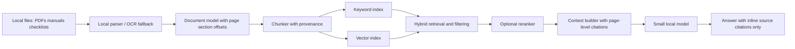
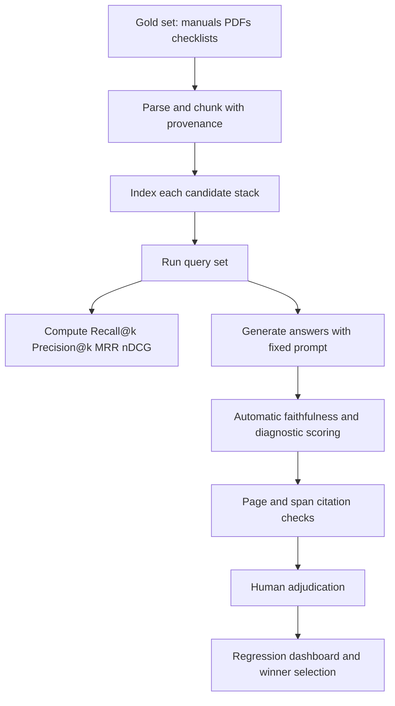

# Fully Local RAG Stacks for Offline Document Retrieval in 2026

## Executive summary

For a fully offline RAG system over PDFs, manuals, SOPs, and checklists, the strongest default choice for a **24-hour hackathon** is a **small, explicit stack with no orchestration framework in the critical path**: local PDF parsing, local embeddings, a local relational store with both keyword and vector search, and a local generator. In practice, the safest path is **entity["organization","SQLite","embedded database project"] + `sqlite-vec` + FTS5 + a local parser such as entity["organization","PyMuPDF","pdf parsing library"] + a local model runner such as entity["company","Ollama","local ai runtime company"]**. That combination has the lowest installation risk, the easiest offline audit story, and the cleanest provenance model for citations because page numbers, section headings, and chunk offsets can live in ordinary relational columns. `sqlite-vec` is still pre-v1, but its stable documented path is simple, dependency-light, and portable across laptops, mobile targets, Raspberry Pi–class devices, and WebAssembly. citeturn22search9turn21view2turn21view3turn29view3turn39search2turn39search8turn39search4

If you need more retrieval headroom than exact SQLite-based search comfortably provides, the next best fully local options are **`LanceDB` local mode** and **entity["company","Qdrant","vector database company"] Edge**. `LanceDB` is the most feature-complete one-process retrieval library among the options here: it supports local-path databases, vector indexing, full-text search with BM25, SQL-style filtering, and built-in hybrid search with reranking. `Qdrant Edge` is the strongest “real vector DB semantics, but embedded” option: it uses the same points/storage model as server Qdrant, supports dense and sparse vectors, payload indexing, filtering, and snapshot compatibility with the server product, while explicitly targeting low-latency local retrieval with no background services. For a hackathon, `LanceDB` is usually the easier route if you want built-in hybrid retrieval; `Qdrant Edge` is more compelling if you want future migration to a sync/server architecture. citeturn16search2turn15view1turn15view2turn15view3turn15view4turn39search11turn18view4turn18view5turn17view2turn17view3turn17view4turn39search7

Several options are materially weaker for a 24-hour build. `sqlite-vss` is no longer in active development, lacks filter support on top of KNN, uses only CPU Faiss, does not support mmap’ed indexes, and requires indexes to fit in RAM. Raw `FAISS`, `hnswlib`, `USearch`, and `Annoy` are excellent ANN primitives, but they push more work onto the application: metadata storage, keyword retrieval, facet/filter logic, and citation generation are your problem. `RAGdb` is an intriguing ultra-portable single-file local RAG container, but it is very new and based on TF-IDF/sub-string hybrid retrieval rather than the mature dense-vector ecosystem most teams expect. `MicroNN` is technically impressive and directly relevant to on-device retrieval, but the primary sources available here are a paper and an entity["company","Apple","micronn research"] research page, not a generally available OSS package, so it is more useful as a design reference than as a dependency you should plan around. citeturn20view6turn20view1turn20view4turn20view5turn13search0turn13search1turn24view0turn24view1turn24view2turn9view0turn9view1turn10view0turn11view0

The most important design conclusion is that **grounding quality for offline document QA is usually dominated more by the indexing pipeline than by the vector store**. Teams often over-focus on ANN libraries and under-invest in page-aware chunking, strong metadata, hybrid retrieval, and reranking. For manuals/checklists, the best quality gains typically come from preserving document structure, carrying page/section provenance into every chunk, using lexical+dense fusion, and only allowing the generator to cite retrieved spans. citeturn15view1turn16search0turn29view3turn39search1turn39search9

## Evaluation scope and offline assumptions

This report assumes a **strict local-first/offline requirement**: documents are parsed locally, indexes are built locally, embedding and generation models run locally, and no telemetry, tracing, or extension auto-download is permitted during normal runtime. That sounds obvious, but many “local” stacks still hide network edges in observability integrations, API-provider defaults, or extension managers. A particularly important example is **entity["organization","DuckDB","embeddable database project"]**: its FTS extension explicitly says it will be transparently autoloaded from the official extension repository on first use, and the VSS extension is separately installed/loaded. In a strictly air-gapped deployment, you must pre-bundle those extensions rather than rely on runtime install behavior. citeturn29view0turn29view1

For citation-heavy QA over manuals and checklists, “offline” also implies a **provenance-first schema**. Every chunk should carry at least: `doc_id`, `page`, `section_path`, `chunk_id`, plain text, and optionally character offsets or bounding boxes. None of the candidate stores here automatically guarantee citation faithfulness on their own; citation quality is an application-layer property built on top of metadata return. Systems with first-class payload/scalar metadata support reduce engineering friction, but they do not replace provenance design. Qdrant exposes payload and payload indexes; LanceDB exposes scalar columns and SQL filters; SQLite and DuckDB can of course store arbitrary metadata in ordinary tables; `sqlite-vec` now supports metadata columns, auxiliary columns, and partition keys inside `vec0` tables. citeturn17view4turn15view2turn21view1turn31search0

A final scoping point: the term “DuckDB+FTS5” is slightly imprecise. **FTS5 is a SQLite module**, while DuckDB has its own `fts` extension and a separate `vss` extension. In practice, the local SQL-heavy patterns that matter are: **SQLite + FTS5 + `sqlite-vec`** for the lightest build, or **DuckDB + `fts` + `vss`** when you want columnar analytics and richer SQL around retrieval. citeturn29view0turn29view1turn29view3

## System landscape and comparison

A useful way to compare local retrieval engines is to separate **ANN core**, **metadata/filter plane**, **keyword plane**, and **provenance storage**. For on-device AI, systems that force you to bolt these together manually can still be excellent, but they are riskier in a hackathon than systems that keep them under one local API.

Raw embedding footprint is mostly determined by datatype, not by the database brand: a `d`-dimensional float32 embedding takes `4d` bytes, int8 takes `d` bytes, and 1-bit binary quantization takes `d/8` bytes before index overhead. That is why Qdrant quantization and `sqlite-vec`/USearch low-precision datatypes matter much more than marketing labels when you are sizing an on-device index. citeturn17view1turn27view2turn21view3

### Requested local systems

| System | Local API, bindings, platforms | Index/search types | Embedding/vector formats | Filtering, hybrid search, citation fit | Footprint tendency | License | 24h hackathon read | Sources |
|---|---|---|---|---|---|---|---|---|
| **Qdrant Edge** | Embedded local shard; Python bindings + Rust crate; local directory storage; designed for limited/intermittent-connectivity environments such as robots, kiosks, home assistants, and mobile phones | Same points API/storage model as Qdrant server; dense + sparse vectors; payload indexes; manual `optimize()`; snapshots compatible with server | Dense and sparse vectors; quantization options in Qdrant include scalar and binary quantization | Strong metadata/payload filtering and facets; dense+sparse makes hybrid feasible; excellent citation fit if you store page/span in payload | **Low–medium**; good local footprint, especially with quantization | Apache 2.0 | Very strong technically; slightly newer/less battle-tested in small-app ecosystems than SQLite-first stacks | citeturn39search11turn18view4turn18view5turn17view2turn17view3turn17view4turn17view1turn39search7turn19view0 |
| **sqlite-vec** | SQLite extension; Python, Go, Rust, Node/Deno/Bun, C/C++, Datasette; runs on laptops, mobile, Raspberry Pi, and WASM/browser | Stable documented path is exact KNN via `vec0` and manual SQL; ANN support exists only as alpha/pre-release (`rescore`, experimental IVF, DiskANN) | Compact SQLite BLOB representation for vectors; float arrays, int8/binary quantization support in project docs | Metadata columns, auxiliary columns, partition keys; hybrid with SQLite FTS5 is straightforward; excellent citation fit because provenance can live in same DB | **Very low**; single C file, no dependencies | MIT/Apache-2.0 dual license in docs | **Best default for a 24h MVP** if your corpus is small/medium and you want the simplest fully local audit story | citeturn22search9turn21view0turn21view1turn21view2turn21view3turn22search21turn23view0 |
| **sqlite-vss** | SQLite extension with bindings for Python, Node, Deno, Ruby, Elixir, Go, Rust, CLI; prebuilt binaries mainly Linux/macOS x86_64 | Faiss-backed `vss0`; default `Flat,IDMap2`; supports custom Faiss factory strings such as IVF | JSON or raw bytes; effectively Faiss-style dense vector workflows | No additional filtering on top of KNN yet; indexes must fit in RAM; hybrid requires separate FTS sidecar; citation fit is okay only if you maintain side tables | **Low raw binary, but medium runtime risk** because indexes are RAM-bound and training-heavy IVF can be slow | MIT | **Not recommended for greenfield**: inactive development, filter limitations, and higher build/runtime friction than `sqlite-vec` | citeturn20view6turn20view0turn20view1turn20view4turn20view5 |
| **FAISS** | C++ core with Python wrappers; CPU packages on Linux x86_64/aarch64, macOS arm64, Windows x86_64; GPU on Linux x86_64 | Extensive family: Flat, IVF, PQ, HNSW, binary indexes, composite indexes, GPU indexes | Dense vectors, binary vectors; many compression/indexing schemes | No built-in document metadata/filter/keyword plane; citations require sidecar store; hybrid requires external BM25/FTS | **Medium–high** unless carefully compressed; can operate beyond RAM with selected designs | MIT | Great ANN engine, weak hackathon choice unless the team already knows Faiss | citeturn13search0turn13search1turn13search5turn13search6turn13search19turn13search14 |
| **LanceDB local mode** | Embedded/local-path database; Python, JavaScript/TypeScript, Java, Rust; C bindings available | IVF and HNSW family in local mode, including quantized variants such as `IVF_HNSW_PQ` and `IVF_HNSW_SQ` | Vector columns in Lance tables with quantized variants available | Strong: SQL filters, scalar indexes, FTS (BM25), hybrid search with RRF by default, built-in rerankers; very good citation fit | **Low–medium**; heavier than SQLite, lighter than server DBs, designed for on-disk retrieval | Apache 2.0 | Best “batteries included” local retrieval engine if you can tolerate a fatter dependency set | citeturn16search2turn15view0turn15view1turn15view2turn15view3turn16search0turn16search1turn15view4 |
| **DuckDB + `fts` + `vss`** | In-process SQL DB with many client APIs: CLI, C/C++, Python, Go, Java, Node, Rust, WebAssembly, more; persistent local `.duckdb` file | `fts` full-text extension; experimental `vss` extension with HNSW over fixed-size `ARRAY` columns | `FLOAT[n]`/fixed-size `ARRAY` vectors for VSS; relational columns for metadata | Good structured filtering and SQL-native provenance; hybrid is possible, but extension packaging matters; watch out for extension autoload/install behavior in strict offline mode | **Low–medium**; columnar engine can spill to disk and handle larger-than-memory workloads | MIT | Strong if your team is SQL-heavy and you prebundle extensions; weaker than SQLite for zero-risk air-gap MVPs | citeturn29view0turn29view1turn29view2turn31search0turn30search14turn29view4 |
| **RAGdb** | Python package; SQLite-based single-file `.ragdb` container; optional FastAPI wrapper | Hybrid retrieval based on TF-IDF weighting + exact substring boosting; local ingestion pipeline for PDFs/docs/images | Not a conventional dense-neural vector stack by default; more a monolithic offline knowledge container | Strong portability; citation fit depends on ingestion/provenance you store; good for simple offline packaging, less ideal if you want state-of-the-art dense retrieval experimentation | **Very low binary footprint** by project claim; lightweight core `<30MB`, optional OCR extras | Apache 2.0 | Interesting but early-stage; use only if you want “single-file offline RAG” more than retrieval flexibility | citeturn9view0turn9view1 |
| **MicroNN** | Research/production on-device library described by Apple research and SIGMOD paper; uses SQLite relational storage internally | Disk-resident IVF ANN, exact KNN/ANN, structured-attribute filters, delta-store updates, query optimizer | Dense embedding vectors stored in relational layout; on-device optimized | Excellent design for on-device filters and updates; citation fit would be good architecturally, but public OSS availability is unclear | **Best published on-device result here**: \<7 ms top-100 at 90% recall using ~10 MB memory on a million-scale benchmark | Not clearly distributed as a public OSS package in the sources reviewed | Architecturally important, but not a practical default dependency for a hackathon | citeturn10view0turn11view0 |

**Interpretation.** If your priority is **minimum failure modes**, `sqlite-vec` wins. If your priority is **feature completeness without a server**, `LanceDB` wins. If your priority is **future migration to a richer vector-DB architecture while staying embedded today**, `Qdrant Edge` wins. If your priority is **paper-grade on-device ANN design**, `MicroNN` is the most relevant reference architecture, but not the most usable dependency. citeturn22search9turn15view1turn39search11turn10view0turn11view0

### Additional embeddable vector and search components

| System | What it is best at | Constraints for offline document QA | Sources |
|---|---|---|---|
| **hnswlib** | Minimal ANN core with C++/Python, HNSW, inserts/updates, deletes, serialization, filtering hooks, low dependency surface | No native keyword plane or citation/provenance store; you must pair it with SQLite/Tantivy/DuckDB | citeturn24view0turn25view1turn25view2turn25view4turn26view0 |
| **USearch** | Extremely compact single-file HNSW engine; many languages/platforms including iOS, Android, WebAssembly, and SQLite integration; many dtypes and memory-mapped/view modes | Same problem as hnswlib: superb ANN core, but hybrid search and citations must be assembled around it | citeturn24view1turn27view2turn27view4turn28search0 |
| **Annoy** | Shipping static mmap’ed read-only indexes to many processes with tiny operational overhead | Poor fit for dynamic corpora, metadata filters, or hybrid document QA; best for frozen indexes | citeturn24view2 |
| **Tantivy** | Very fast embedded full-text search in Rust; small startup time; good tokenizer support; incremental indexing | Pure keyword engine; pair with a vector sidecar if you want semantic retrieval | citeturn24view3turn24view4 |

## Hackathon tradeoffs and recommended minimal stack

The key 24-hour dimensions are **installation risk**, **offline guarantees**, **runtime simplicity**, **citation support**, and **hybrid retrieval**.

For those criteria, the systems sort roughly as follows:

| Tier | Systems | Why |
|---|---|---|
| **Best for 24h MVP** | `sqlite-vec` + SQLite FTS5; `LanceDB` local | Lowest operational risk; one-process local build; clean metadata story; hybrid search available directly or with very little glue |
| **Very good if you want future scale-up** | Qdrant Edge; Qdrant local mode | Better vector-DB semantics, filters, sparse+dense story, migration path to server/sync, but slightly more moving pieces |
| **Good ANN primitives, but more assembly required** | FAISS, hnswlib, USearch, Annoy, Tantivy | Excellent components, not full local document-RAG stacks on their own |
| **Use with caution** | sqlite-vss, RAGdb | sqlite-vss is inactive and limited; RAGdb is innovative but early and not aligned with the mainstream dense+hybrid local ecosystem |
| **Research reference, not default dependency** | MicroNN | Outstanding design; unclear public packaging from the primary sources reviewed |

### Recommended minimum viable stack

The most robust minimal stack I would recommend for a weekend build is:

| Layer | Recommended component | Version / pin | Why this choice |
|---|---|---|---|
| Local model runtime | entity["company","Ollama","local ai runtime company"] | **v0.23.0** from the official GitHub release listing | Simple local runtime; good offline ergonomics; works well with local chat + embeddings workflows citeturn39search4turn39search8 |
| PDF extraction | PyMuPDF | **1.27.2.3** documented in upstream docs/changelog | Fast, high-quality local PDF extraction with no mandatory external dependencies citeturn39search2turn39search6turn39search18 |
| Vector layer | `sqlite-vec` | **0.1.9** stable latest release listed on GitHub releases | Lowest install/build risk; good metadata/citation story; runs almost everywhere citeturn23view0turn22search9turn21view2 |
| Keyword layer | SQLite FTS5 | Bundled with SQLite | Low-risk lexical retrieval for exact strings, part numbers, checklist terms, headings, warnings, acronyms citeturn29view3 |
| Generator | Ollama local chat model | Pin local artifact digest after pull; docs show `llama3.1` local usage | Keeps answer generation local; straightforward to swap smaller/larger models later citeturn34view2turn34view5 |
| Embeddings | Ollama local embedding model **or** Sentence Transformers | Prefer local Ollama embedding model for simplest packaging; if using Sentence Transformers, current docs show **v5.4** and support both embeddings and CrossEncoder rerankers | Keeps embedding and reranking local; no provider API required citeturn34view3turn39search1turn39search9 |

**Exact commands for the recommended MVP**

```bash
# local model runtime
curl -fsSL https://ollama.com/install.sh | sh
ollama pull llama3.1
ollama pull nomic-embed-text

# python environment
python -m venv .venv
source .venv/bin/activate

# local parsing + storage
pip install "pymupdf==1.27.2.3" "sqlite-vec==0.1.9"
```

If you want one more quality layer and are willing to install a larger ML package set, add a local reranker from Sentence Transformers / CrossEncoder after the MVP is working. The framework explicitly supports both embedding models and cross-encoder rerankers. citeturn39search1turn39search9

### What this MVP should do on day one

On day one, do **not** chase ANN sophistication. Build the following first:

1. Parse PDFs into page-aware chunks.
2. Store chunks and provenance in SQLite.
3. Index chunk text in FTS5.
4. Store embeddings in `sqlite-vec`.
5. Retrieve with lexical+dense fusion.
6. Rerank only the top 20–50 candidates if time permits.
7. Generate answers that may **only cite retrieved chunks**.

That path gets you to a believable offline demo faster than trying to optimize HNSW or IVF on day one.

## Architecture patterns for grounded offline RAG

For manuals, SOPs, and checklists, the best architecture is **small model + strong retrieval + deterministic citations**. The retrieval layer should do more work so the generator can do less.



The indexing pipeline should preserve structure aggressively. For digitally born PDFs, extract text locally with page boundaries intact. For manuals, keep section heading ancestry. For checklists, keep one checklist item per chunk whenever possible. For tables and warnings, avoid chunks that cross semantic boundaries just to hit an arbitrary token target. The moment you blur page or section provenance, citation generation gets much harder and hallucination containment gets weaker. PyMuPDF is a practical local parser foundation for this stage. citeturn39search2turn39search10

For chunking, use **citation-friendly chunks rather than model-friendly chunks**. In practice that means shorter chunks than many cloud RAG tutorials recommend: often one heading subsection, one procedure step block, one warning block, or one table row group. For manuals/checklists, chunk sizes in the **rough neighborhood of 300–700 tokens with modest overlap** are a good starting point, but the higher-order rule is to preserve semantic and page coherence. That recommendation is architectural rather than vendor-specific; none of the stores here will fix poor chunk boundaries for you.

For embeddings, the most important choice is not “largest model” but **small, stable, local, and consistent**. The upstream Sentence Transformers project is still one of the most practical local embedding/reranking toolkits, and current official docs also emphasize CrossEncoder rerankers. LlamaIndex’s local tutorial likewise demonstrates a local embedding + local Ollama pattern rather than relying on remote APIs. citeturn39search1turn39search9turn34view5

For retrieval, the best default strategy for document QA is:

- **lexical retrieval** for exact anchors: part numbers, section titles, error codes, checklist verbs, warnings;
- **dense retrieval** for paraphrase/semantic coverage;
- **fusion** with reciprocal rank fusion or an equivalent stable combiner;
- **light reranking** over the fused candidate set when latency allows.

LanceDB’s default hybrid path already uses RRF; SQLite+FTS5+`sqlite-vec` can implement the same pattern manually; Qdrant’s dense+sparse setup supports a similar approach. citeturn15view1turn16search0turn17view2turn22search21

For citation generation, make citation IDs deterministic from metadata, not from LLM free text. The LLM should receive context blocks in a format like:

- `[S1] manual_a.pdf p.14 §3.2`
- `[S2] checklist_b.pdf p.2 item 7`

Then require the answerer to cite only those IDs. After generation, post-validate every cited ID against the retrieved chunks and reject any answer that cites an ID not present in the retrieval set. That last step is simple, fast, and dramatically improves trustworthiness.

A sensible design target for a local laptop or ARM-class device is **sub-second retrieval**, **roughly low-hundreds-of-milliseconds reranking**, and then whatever generation latency your chosen local model can sustain. For a hackathon, it is completely acceptable to optimize for retrieval quality first and let answer generation take a few seconds.

## Auditing frameworks for zero-network behavior

The biggest hidden risk in “local” RAG builds is not the vector store. It is the orchestration layer.

### LlamaIndex audit pattern

The most important official LlamaIndex guidance is explicit: set the global `Settings.llm` and `Settings.embed_model` to local implementations, and then “you can ensure OpenAI will never be used in the framework.” The local Ollama docs show local models served on `localhost:11434`, and the local getting-started tutorial shows a local-LLM/local-embedding setup rather than remote defaults. citeturn34view1turn34view2turn34view3turn34view5

A safe Python pattern is:

```python
from llama_index.core import Settings
from llama_index.llms.ollama import Ollama
from llama_index.embeddings.ollama import OllamaEmbedding

Settings.llm = Ollama(model="llama3.1:latest", request_timeout=120.0)
Settings.embed_model = OllamaEmbedding(model_name="nomic-embed-text")
```

In addition to pinning local models, do **not** enable observability handlers or OpenTelemetry exporters in offline mode. LlamaIndex observability is explicitly configured through global handlers and optional OpenTelemetry integrations; if you wire those up to remote backends, you have reintroduced a network edge. citeturn35search0turn34view4turn35search3

Concrete LlamaIndex audit steps:

- unset `OPENAI_API_KEY`, `ANTHROPIC_API_KEY`, `MISTRAL_API_KEY`, and similar provider variables before tests;
- grep the codebase for provider imports and observability setup;
- make `Settings.llm` and `Settings.embed_model` explicit in app startup **and** in any per-component overrides;
- avoid examples or helper classes that silently assume OpenAI-style defaults;
- if you install observability packages, verify they are not instantiated anywhere.

### LangChain audit pattern

For **entity["organization","LangChain","llm framework"]**, the two major audit concerns are **provider selection** and **LangSmith tracing**. Official docs provide a direct switch: `LANGSMITH_TRACING=false` disables tracing to LangSmith, and the LangSmith docs also support `tracing_context(enabled=False)` for selective or hard runtime suppression. LangChain’s Ollama integration covers local chat/embedding models, and the Qdrant integration explicitly demonstrates local, on-disk mode without a server. citeturn38view0turn38view1turn38view2turn38view3turn38view4

A minimal safe pattern is:

```python
import os
os.environ["LANGSMITH_TRACING"] = "false"

from langchain_ollama import ChatOllama, OllamaEmbeddings

llm = ChatOllama(model="llama3.1:latest")
emb = OllamaEmbeddings(model="nomic-embed-text")
```

If you also use LangSmith SDK anywhere in the stack, wrap sensitive execution in:

```python
import langsmith as ls

with ls.tracing_context(enabled=False):
    ...
```

Concrete LangChain audit steps:

- set `LANGSMITH_TRACING=false` explicitly in the process environment;
- grep for `langsmith`, `LANGSMITH_`, `ChatOpenAI`, `OpenAIEmbeddings`, `Anthropic`, `Google`, `Mistral`, `Vertex`, and raw `https://` endpoints;
- prefer local integrations such as `ChatOllama`, `OllamaEmbeddings`, and local vector stores;
- avoid notebooks/examples that ask you to uncomment LangSmith credentials;
- if you use Qdrant in LangChain, instantiate it in local `:memory:` or `path=` mode for offline testing. citeturn38view0turn38view1turn38view2turn38view3

### Framework-agnostic hidden-cloud audit checklist

Use the same checklist even if you avoid frameworks:

- **Pre-download** everything: model blobs, tokenizer files, DB extensions, wheels.
- **Start with no provider keys** in the environment.
- **Block outbound network** during integration tests and see what breaks.
- **Log connections** at the OS level during smoke tests.
- **Search source and lockfiles** for provider SDKs and tracing backends.
- **Ban runtime installs** of extensions or models.
- **Fail closed**: if a local model is unavailable, error loudly instead of falling back.

One subtle but important example beyond frameworks is DuckDB extension install/autoload, which can reach out to the official extension repository unless you package extensions ahead of time. citeturn29view0turn29view1

## Benchmarking retrieval quality and citation faithfulness

Quality evaluation for offline document QA needs two layers:

1. **retrieval quality**: did the right chunks/pages surface?
2. **answer grounding quality**: did the answer stay inside those chunks/pages?

For public retrieval baselines, **BEIR** remains useful because it is a heterogeneous zero-shot IR benchmark spanning 18 datasets, and **MIRACL** is the right multilingual companion when your manuals or procedures go beyond English. Those are useful for model/index sanity checks, but they are not enough for citation-grade PDF QA, so build a **private benchmark from your own manuals/checklists** as well. citeturn40search16turn40search4turn40search19turn40search3

The most useful evaluation set for your actual product is synthetic-but-auditable:

- generate questions from headings, procedures, warnings, and tables;
- create “needle” questions for part numbers, reset codes, torque values, dates, and exceptions;
- create paraphrase questions for semantic retrieval;
- create contradiction traps where a neighboring section is similar but wrong;
- label the exact supporting page(s) and, ideally, the exact supporting span(s).

For retrieval, the core metrics should be:

- **Recall@k**: whether any gold-supporting page/chunk appears in top-k;
- **Precision@k**: how much of top-k is actually useful;
- **MRR**: whether the first correct hit appears early;
- **nDCG@k** if you have graded relevance.

BEIR’s repository is built around common IR evaluation workflows, and that should inform your metric harness. citeturn40search4turn40search16

For generation/citation quality, use a combination of automatic and human checks. **Ragas** exposes component-wise RAG metrics including **faithfulness**, context precision/recall, and related measures; its faithfulness metric explicitly asks whether claims in the response are supported by the retrieved context. **RAGChecker** goes further as a fine-grained diagnostic framework for RAG, with separate metrics for retrieval and generation behavior. citeturn40search1turn40search9turn40search17turn40search18turn40search2

For citation-heavy document QA, I strongly recommend adding three custom product metrics that generic benchmarks usually miss:

- **Page citation accuracy**: percentage of answer claims whose cited page actually supports the claim.
- **Span citation accuracy**: percentage of claims supported by the cited chunk/span, not just somewhere else in the document.
- **Wrong-page hallucination rate**: percentage of answers that include a citation, but the cited page does not support the nearby claim.

A simple human eval protocol works well:

- mark each answer **supported / partially supported / unsupported**;
- separately mark each citation **exact page / wrong page / missing**;
- separately mark whether the answer omitted a crucial warning, exception, or prerequisite;
- review at least 50–100 examples per stack variant before choosing a winner.



In practice, a weekend benchmark harness should hold **everything except the retrieval stack constant**: same corpus, same chunking, same embedding model, same prompt, same generator, same `k`, same reranker. Otherwise, you are not benchmarking the local store; you are benchmarking a moving target.

## Security, privacy, and limitations

The strongest privacy property of a local RAG stack is not “uses a local vector DB.” It is **no network dependency at all during steady-state operation**. SQLite is explicitly serverless/in-process; DuckDB is an in-process database that runs on laptops, servers, and in the browser; Qdrant Edge is designed specifically for local retrieval without background services. Those properties are what make these stacks attractive in regulated or air-gapped settings. citeturn22search19turn29view2turn39search11

For offline compliance, the practical controls are straightforward:

- pre-stage and checksum all model artifacts and DB extensions;
- remove provider API keys from the runtime environment;
- disable or omit all tracing/export integrations;
- deny outbound network at the OS/container level during QA and production;
- keep the retrieval DB and original documents on encrypted local storage if policy requires it;
- record a manifest of model names, DB versions, and index settings used to produce each benchmark run.

Two implementation details matter more than teams usually expect. First, provenance fields are part of your security story because they let you prove where answers came from. Second, runtime installers are part of your privacy story because they can silently cross the network even when “the app is local”; DuckDB extension autoloading and agent-framework tracing are common examples. citeturn29view0turn29view1turn38view0turn38view1turn34view4

### Open questions and limitations

A few parts of this landscape remain genuinely unsettled.

`MicroNN` is highly relevant to on-device AI, and the paper is unusually strong on real-world constraints, but the sources reviewed here do not expose it as a standard public OSS dependency in the same way as the other candidates. I would treat it as an architectural benchmark, not as a practical install target. citeturn10view0turn11view0

`RAGdb` is promising for “single-file knowledge container” use cases, but it is early, sparsely adopted in the reviewed sources, and its retrieval model is better understood as lightweight hybrid lexical retrieval than as a full dense-vector experimentation platform. citeturn9view0turn9view1

`sqlite-vec` remains the best low-risk local MVP choice in spite of being pre-v1, but its ANN roadmap is still partly pre-release. For a hackathon that is acceptable. For a larger corpus or longer-lived product, you should explicitly benchmark it against LanceDB or Qdrant before committing. citeturn23view0turn22search9

The clearest recommendation, therefore, is:

**Use SQLite + FTS5 + sqlite-vec + local PDF parsing + local embeddings + a small local generator for the first 24-hour build. If you outgrow exact search or want first-class hybrid/rerank ergonomics, move to LanceDB local. If you want embedded vector-DB semantics and a future sync/server path, move to Qdrant Edge / Qdrant local.** citeturn22search9turn29view3turn15view1turn16search2turn39search11