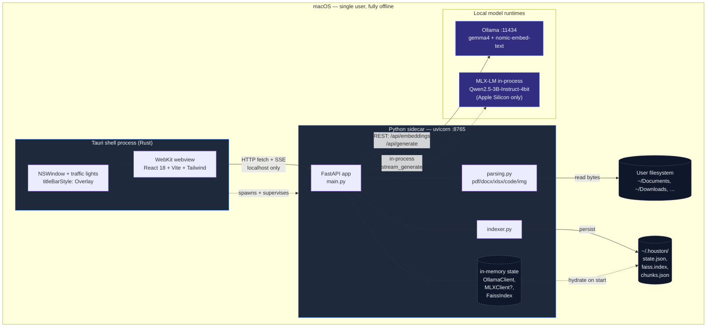

# 01 — System Overview

Houston is a **three-process** desktop app — everything stays on the
user's Mac. No daemon ever opens an outbound socket.

- **Tauri shell** (Rust) — owns the native window, the macOS
  traffic-light chrome, and the WebKit webview. Spawns the sidecar.
- **Python sidecar** (FastAPI on `127.0.0.1:8765`) — does parsing,
  embedding, FAISS retrieval, and LLM orchestration.
- **Ollama** (`127.0.0.1:11434`) — runs `gemma4` (multimodal, vision)
  and `nomic-embed-text` (768-dim embeddings).
- **MLX-LM** (in-process, optional) — Apple Silicon inference path
  using `Qwen2.5-3B-Instruct-4bit`. Auto-falls-back to Ollama if
  unavailable.

**Why three processes?** The Rust shell gives us a real native
window and tight macOS chrome control. The Python sidecar isolates
heavyweight Python deps (faiss, openpyxl, pypdf, mlx) so the Rust
side stays small. Ollama is its own daemon because the user already
runs it for other tools — sharing the same model cache is free.

**Why localhost only?** Hackathon track is "Cut the Cord". The
sidecar binds to `127.0.0.1` and never resolves an external host.
You can pull the Ethernet cable and Houston still works.
