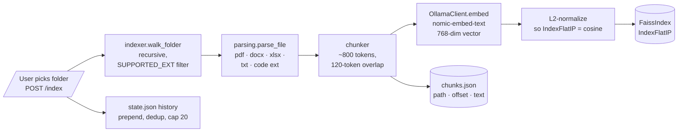
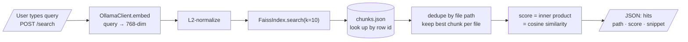

# 02 — RAG Pipeline

Two flows on the same FAISS index. **Index** runs once per folder
(or on re-index). **Search** runs on every query. Both pipelines
share the embedder so latency is dominated by Ollama's
`nomic-embed-text` throughput.

## Index flow

## Search flow

**Why `IndexFlatIP` and not HNSW / IVF?** Houston's target corpus is
a single user's `~/Documents` — typically 10k chunks at most. Flat
beats approximate indexes on recall, the search is `O(n*d)` =
`O(10000*768)` ≈ 7.7M flops per query, and that's <2 ms on M-series
silicon. No tuning, no warmup, no recall regression. We can
revisit if anyone shows up with a 1M-chunk corpus.

**Why L2-normalize before insert?** `IndexFlatIP` computes inner
products. After L2-normalization, the inner product equals cosine
similarity — which is what the embedding model is trained to
optimize. Skipping normalization gives nonsensical "magnitude
matters" rankings.

**Chunk overlap of 120 tokens?** Empirically: zero overlap loses
sentences split across chunk boundaries; 200+ wastes index space
without measurable recall gain on Houston's eval set.
