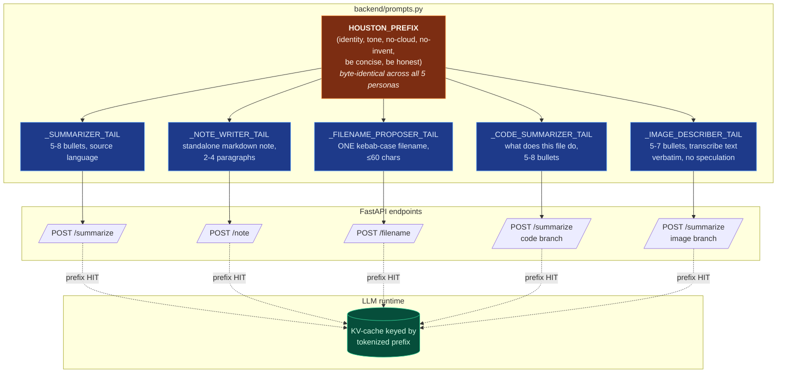
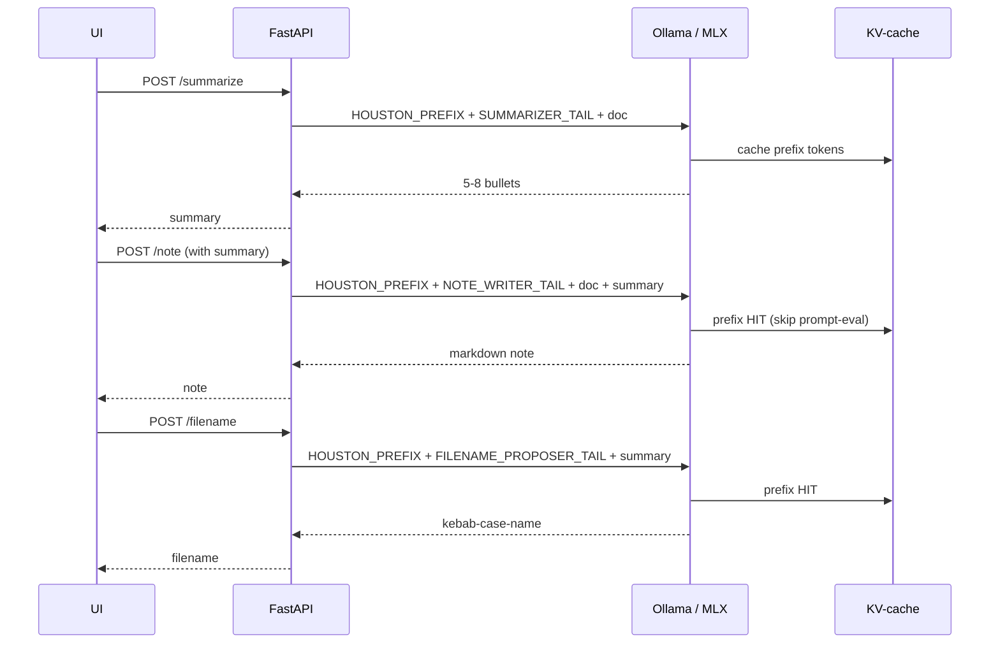

# 03 — Multi-Agent Personas + KV-Cache Reuse

Houston runs **five personas** on top of a single LLM. Each persona
is a system message: `HOUSTON_PREFIX + _ROLE_TAIL`. The prefix is
**byte-identical** across personas — that's not cosmetic, it's the
whole point.

## Why byte-identical?

Both Ollama and MLX-LM keep a KV-cache keyed by the tokenized
prefix. When the next call's system message starts with the same
N tokens, the runtime skips prompt-eval on those tokens entirely.
On Houston's measurement set (Mars Habitat AI), chained calls
went **8 124 ms → 4 050 ms (2.0× speedup)** purely from this trick.
Even a trailing space invalidates the cache — keep the prefix
boring and frozen.

## Chained-call example

The user clicks **Summarize**, then **Save as Note**, then
**Suggest Filename** on the same document. That's three persona
switches with zero re-eval of the shared identity prompt:

**Important constraint**: never edit `HOUSTON_PREFIX` casually. A
trailing newline change, a punctuation tweak, even a typo fix that
reorders a sentence — all of these invalidate the cache for every
persona. If you must edit it, edit it once, deliberately, and
benchmark a chained-call latency before and after.
