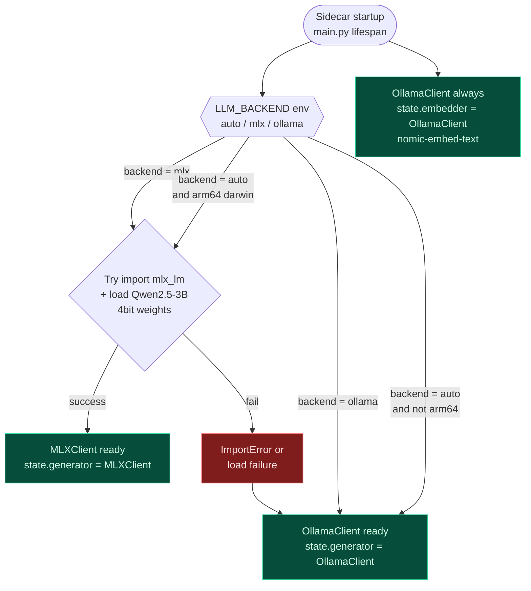
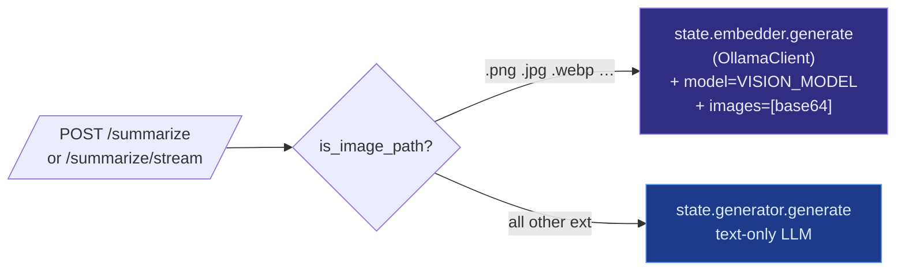

# 04 — LLM Backend Routing

Houston picks its LLM runtime at startup based on `LLM_BACKEND` env
var. **One** path is text-only with a fast Apple-Silicon route;
**vision** always falls through to Ollama because MLX-LM doesn't
take images in our current setup.

## Per-request dispatch

Once the sidecar is up, `state.generator` holds whichever client
won the boot race. Every text endpoint routes through it. **Vision
is the exception** — image describe always uses
`state.embedder` (the OllamaClient instance) regardless of
`LLM_BACKEND`.

## Why MLX as primary on Apple Silicon?

| Metric | Ollama gemma4 | MLX-LM Qwen2.5-3B-4bit |
|---|---|---|
| Process model | Separate daemon, HTTP/JSON | In-process, Python objects |
| Cold start | ~3 s (already loaded) | ~800 ms |
| Tokens/sec | ~25 t/s | ~60 t/s |
| Quantization | Q4_K_M (gemma4 default) | 4-bit native MLX |
| Vision | ✅ multimodal | ❌ text-only |

MLX is faster on text. Ollama is the fallback **and** the only path
for vision. The `state.generator` / `state.embedder` split lets us
mix-and-match without leaking runtime details into endpoint
handlers.

## Why `auto` is the default?

Hackathon judges may run the demo on Intel Macs, on Linux, on
machines without `mlx_lm` pip-installed. `auto` tries MLX, swallows
any `ImportError` or weight-load error, falls back to Ollama, logs
which backend won. **No hand-holding, no manual config.**
