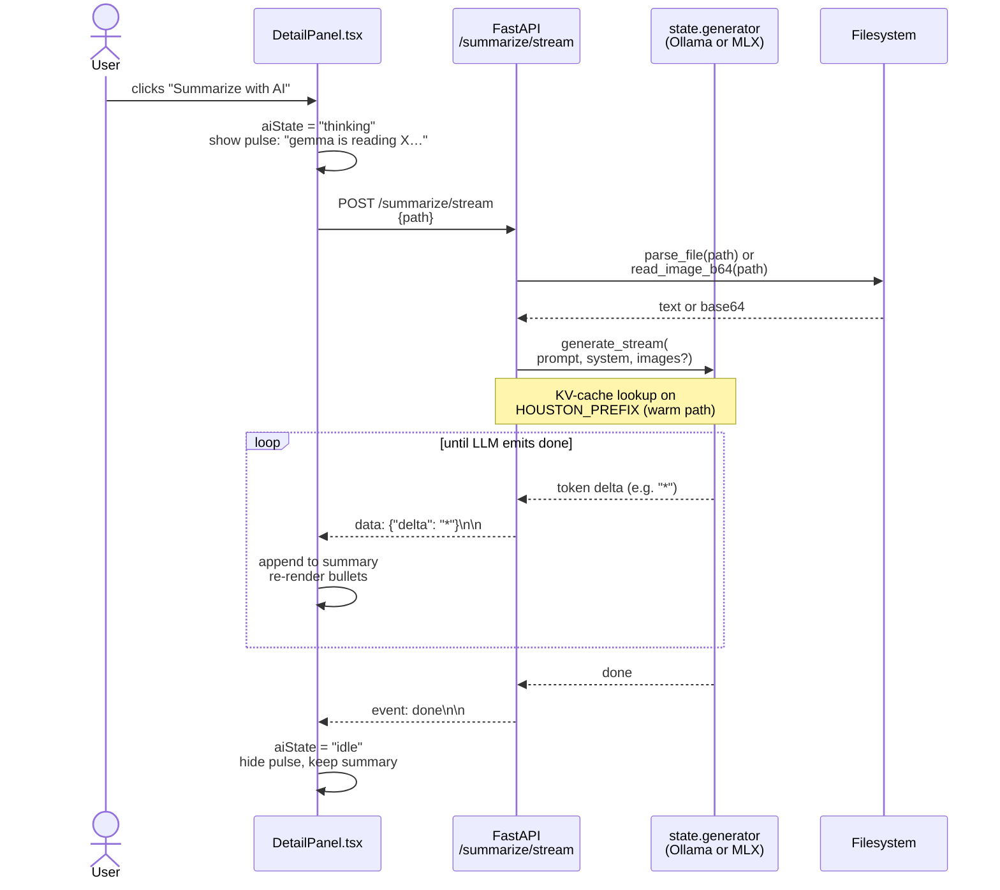
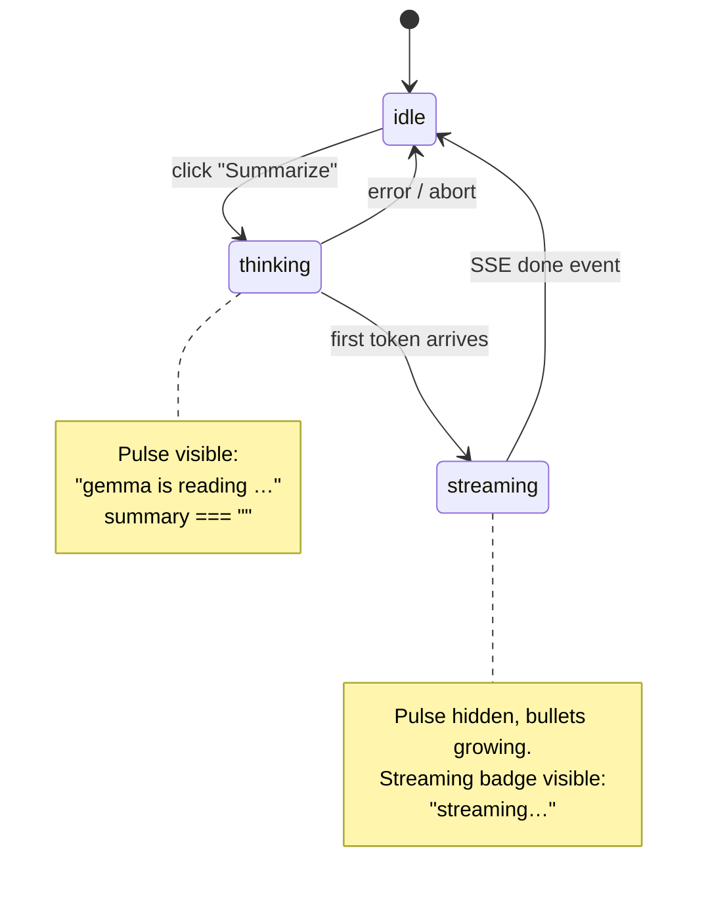

# 05 — Streaming Summarize (SSE)

`/summarize/stream` pushes tokens to the webview as the LLM
produces them. The user sees bullets pop in **letter by letter**
instead of staring at a spinner for 9 seconds.

Wire format: standard Server-Sent Events. `text/event-stream`
content type, one `data: {json}\n\n` block per token chunk, final
`event: done\n\n` to close.

## UI state machine

The renderer has three observable states. Only one is shown at a
time — the pulse and the bullets never co-exist.

## Why SSE and not WebSockets?

- **One-way**: server pushes tokens, client never sends data
  during streaming. SSE is purpose-built for this; WebSockets
  carry bidirectional overhead we don't need.
- **HTTP semantics**: `EventSource` (or `fetch` + `ReadableStream`)
  reuses keep-alive, cookies, status codes. No new auth surface.
- **Auto-reconnect**: SSE has it built in; we don't actually need
  it for localhost, but it's free.
- **Render simplicity**: each `data:` line is a JSON token delta.
  Append to a string, re-parse markdown, done.

## Why we don't use `EventSource` directly?

`EventSource` doesn't support `POST` or custom headers in any
browser. Houston posts a JSON body (the file path) so we use
`fetch` + `response.body.getReader()` and parse the SSE stream
manually. The frontend code is a 30-line reader loop in
`DetailPanel.tsx` — see `parseSSEEvent`.
