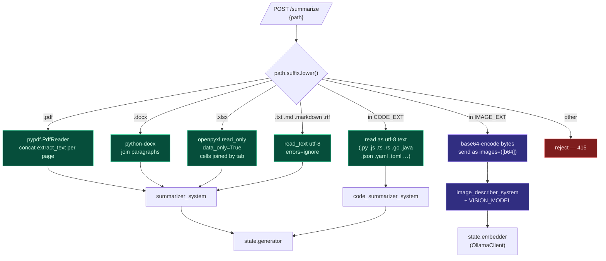

# 06 — File-Type Routing

One endpoint (`/summarize`) handles every supported file type.
Routing is **all extension-driven** — no MIME sniffing, no magic
bytes. The decision flow:

## Persona dispatch table

The reader fills `text` (or `images` for vision). The persona then
decides what kind of bullets come out.

| Extension family | Reader | Persona function | Output style |
|---|---|---|---|
| `.pdf .docx .txt .md .rtf` | text | `summarizer_system()` | 5–8 bullets, source-language |
| `.xlsx` | sheet-by-sheet TSV | `summarizer_system()` | 5–8 bullets, "this spreadsheet tracks…" |
| `.py .js .ts .rs .go .java .json .yaml …` | utf-8 text | `code_summarizer_system()` | 5–8 bullets, "what this file does" |
| `.png .jpg .webp .heic .gif .bmp .tiff .jpeg` | base64 bytes | `image_describer_system()` | 5–7 bullets, transcribe text verbatim |

## Why extension-driven and not MIME?

- The file is on the user's local disk. Extensions are reliable
  enough; the rare misnamed file (a JPEG saved as `.txt`) just
  gets parsed as text and produces a confused bullet list. Not
  a security boundary — Houston never executes the contents.
- MIME sniffing means reading the first N bytes of every file in
  the picker preview. That's I/O the OS already paid for; we
  don't redo it.

## Why XLSX as TSV instead of structured JSON?

The LLM doesn't need to know columns from rows; it needs the
**values**. Tab-separated cells with sheet headers as `# Sheet:`
markers parses cleanly in the model's prompt and uses ~30% fewer
tokens than equivalent JSON. Empty rows are skipped so the LLM
doesn't waste context on whitespace.

## What's NOT supported (yet)

- `.pptx`, `.key` — no parser. Open issue.
- `.epub` — would parse with `ebooklib`. Out of scope for hackathon.
- Images **embedded** inside docx / pdf — the text extraction
  ignores them. We'd need a docx → unzip → media folder pass.
- Encrypted PDFs — `pypdf` raises; we don't catch it explicitly.
