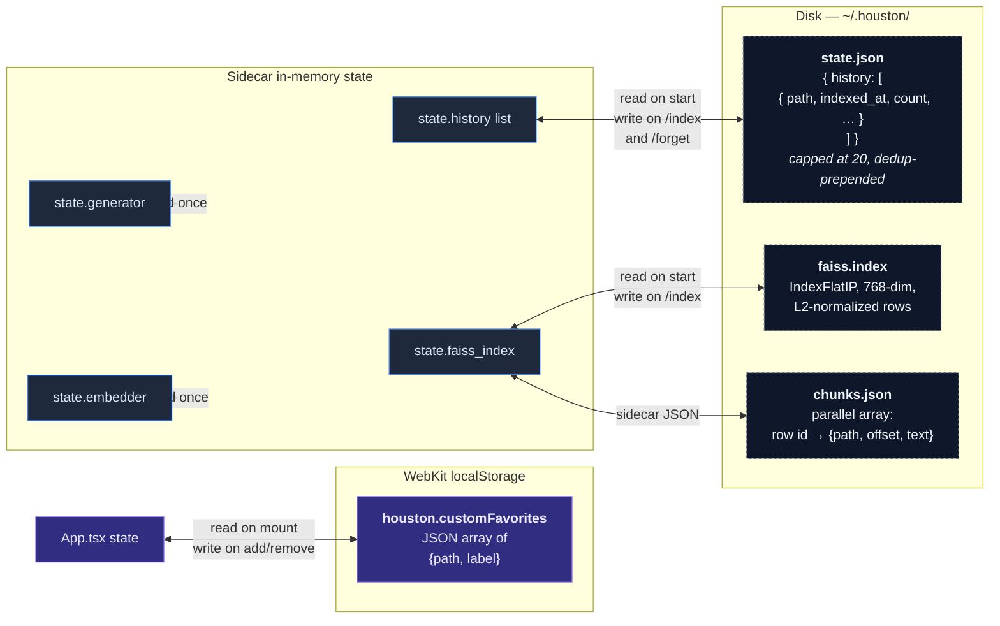

# 07 — State Persistence

Houston has **three** places it remembers things across restarts.
None of them ever leave the user's Mac.



## state.json — indexed-folder history

Schema:

```json
{
  "history": [
    {
      "path": "/Users/fp/Documents/projects",
      "indexed_at": "2026-05-09T14:32:11Z",
      "file_count": 247,
      "chunk_count": 1843
    }
  ]
}
```

- **Prepend on /index** — newest first.
- **Dedup by path** — re-indexing the same folder bumps it to top
  and updates `indexed_at` instead of growing the list.
- **Cap at 20** — older entries fall off. The user can always
  re-add a folder; we don't need infinite history.
- **Migration**: legacy `state.json` was a single object (the
  current root). On read, if no `history` key, we wrap it as
  `{history: [old_root]}` for free.

## faiss.index + chunks.json

Two files written in lock-step. `faiss.index` is the FAISS binary
format; `chunks.json` is a parallel array — `row N` in FAISS maps
to `chunks[N]` in JSON. Re-index = atomic-write both, then swap
references in memory.

## localStorage — custom favorites

Lives in WebKit's localStorage under key `houston.customFavorites`.
The user adds via right-click → **Add to Favorites** in the
context menu; `App.tsx` updates the React state and serializes to
localStorage in the same handler.

```ts
// App.tsx — pseudocode
const [customFavorites, setCustomFavorites] = useState(() => {
  const raw = localStorage.getItem("houston.customFavorites");
  return raw ? JSON.parse(raw) : [];
});

useEffect(() => {
  localStorage.setItem(
    "houston.customFavorites",
    JSON.stringify(customFavorites),
  );
}, [customFavorites]);
```

**Why localStorage and not the sidecar?** Custom favorites are a
pure UI concern — sorting, presence in the sidebar, paths the
user wants pinned. They don't need to be queryable by the LLM,
they don't need cross-process sync, and the webview is the one
that renders them. Adding a `/favorites` endpoint would be
ceremony.

## What does NOT get persisted

- **The user's actual file contents** — we re-parse on every
  summarize. No caching layer.
- **Embeddings of one-off summarize requests** — only `/index` writes
  to FAISS.
- **LLM responses** — never cached. Each summary is fresh; the user
  can ask twice and get differently-worded bullets.
