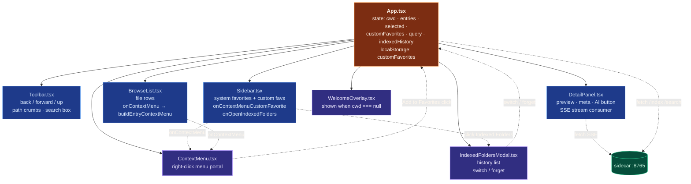
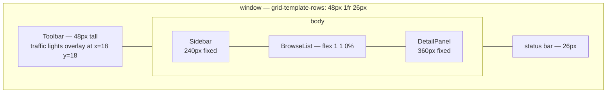

# 08 — Frontend Component Tree

Houston's UI is a **single-page React 18 app** with a tight
component tree. State lives in `App.tsx` and flows down via props.
No Redux, no Zustand — props + a couple of `useState` hooks are
plenty for a hackathon-scale app.

## Layout grid

The window is a **3-row × 2-column grid** with the toolbar
spanning the full width and a status bar at the bottom:

## Data flow for "Summarize an image"

1. User clicks a `.png` in **BrowseList**.
2. `App.tsx` sets `selected = entry`.
3. **DetailPanel** receives `file = selected` via props.
4. `kindOfFilename` returns `"img"` — the preview shows the image.
5. User clicks **"Describe with AI"** (button label flipped by
   `isImageFilename`).
6. `runSummary()` POSTs to `/summarize/stream` with the path.
7. SSE deltas append to local `summary` state; the bullets render
   live.
8. On `event: done`, `aiState` flips back to `"idle"`.

State boundary: **DetailPanel owns the streaming summary state**
(it's transient, scoped to one file). **App owns** what file is
selected, what folder is open, and persistent favorites. This
keeps the SSE reader local — nobody else needs to know it
exists.

## Why custom context menu (not the OS menu)?

`event.preventDefault()` on `oncontextmenu` lets us render the
menu inside the webview. Two reasons:

- **Cross-platform consistency** — Houston shouldn't look
  different on macOS vs Linux even if today it only ships for
  macOS.
- **Action attachment** — "Add to Favorites" can call back into
  React state directly. With the OS menu we'd need to bridge
  through Tauri's `MenuBuilder` and `emit` events, which is more
  ceremony for the same outcome.

The menu is a **portal-mounted absolute-positioned div** that
closes on outside-click and on `Escape`. Standard pattern.
