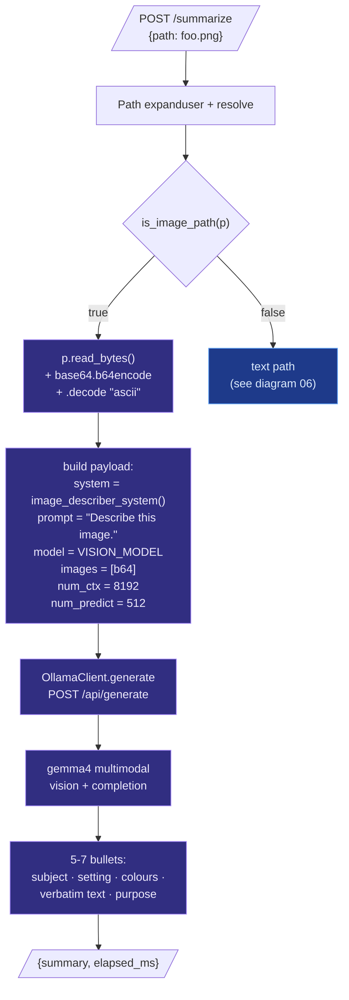
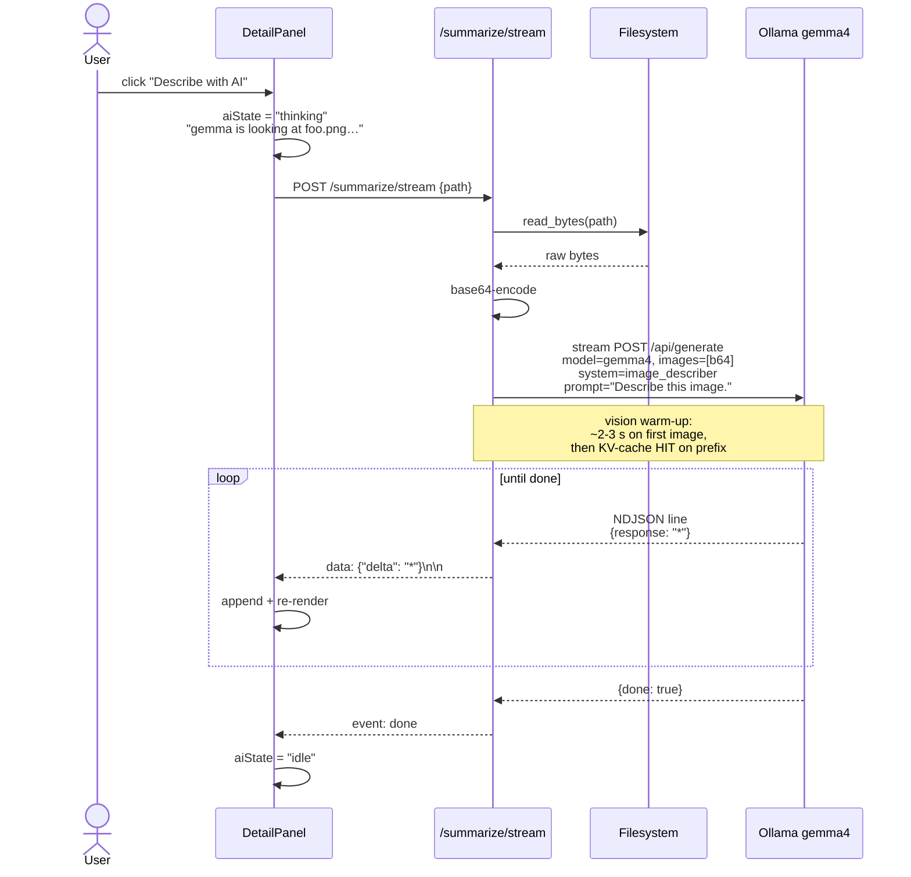

# 09 — Vision Pipeline (Image Describe)

The vision path is a **slim variation** on the regular summarize
flow. Same endpoints, same persona scaffolding, but the input is
base64 image bytes instead of extracted text, and the model is
`VISION_MODEL` (defaults to `gemma4:latest`, which is multimodal:
`completion · vision · audio · tools · thinking` per `ollama show`).



## Streaming variant

`/summarize/stream` follows the same branch but uses
`generate_stream` so bullets pop in token-by-token. The webview
shows **"gemma is looking at <name>…"** during the thinking
state, then renders bullets live.



## Live verification

```bash
$ curl -s -X POST http://127.0.0.1:8765/summarize \
    -H 'Content-Type: application/json' \
    -d '{"path":"~/Downloads/light/07-voice-roundtrip-breakdown.png"}'
```

Result on a 1920×1080 stacked-bar-chart screenshot, **9.7 s warm**:

> * The image is a stacked bar chart titled **"Voice round-trip
>   breakdown · whisper.cpp + LLM + macOS say"**.
> * The Y-axis represents **Wall latency (ms)**, ranging from 0
>   to over 3500 ms.
> * The X-axis shows three data points labeled **run 1**,
>   **run 2**, and **run 3**.
> * The legend indicates three components: **whisper.cpp ASR**
>   (blue), **LLM (warm RAG)** (purple), and **macOS say TTS**
>   (orange).
> * Total latency for **run 1** = **3294 ms**, with the largest
>   segment being the orange **macOS say TTS** component.
> * Total latency for **run 2** = **2621 ms**, **run 3** =
>   **2637 ms**.
> * The apparent purpose of the image is to visually compare the
>   latency breakdown of a voice processing pipeline across three
>   different runs.

The model:
- Identified the chart type and read the title verbatim.
- Read both axis labels.
- Listed the legend with colours.
- Extracted the per-bar millisecond annotations.
- Identified which segment dominated.
- Inferred the apparent purpose without speculating about origin.

## Why MLX doesn't get vision

`mlx_lm.stream_generate` doesn't accept image inputs in our
current setup — `mlx-vlm` would, but it's a separate package with
its own model loader and doesn't share weights with the
text-only Qwen2.5 we use for fast text. Adding `mlx-vlm` would
double the on-disk model footprint for a feature that ships with
a single user-visible button. **Decision**: vision = always
Ollama, regardless of `LLM_BACKEND`. The split happens in
`main.py`:

```python
# Vision always uses state.embedder (the OllamaClient instance)
# because MLX-LM doesn't accept image inputs.
client = state.embedder if is_image_path(p) else state.generator
```

## Why `num_ctx = 8192` for images?

Multimodal models tokenize images into a chunk of vision-encoder
tokens (gemma4: ~256 tokens per image at 896×896). Default
`num_ctx = 4096` works for short text but leaves no room for the
image embedding plus a 5-7 bullet response. Bumping to 8192
gives ~512 tokens of headroom for the response after the image
is encoded.

## Configuration

```bash
# .env or shell
VISION_MODEL=gemma4:latest          # default
# VISION_MODEL=llava:7b             # alternative on memory-constrained Macs
# VISION_MODEL=qwen2.5-vl:7b        # alternative with stronger OCR
```

The vision model is decoupled from `GEN_MODEL` so you can run a
fast text model (e.g. via MLX) alongside a beefier vision model
in Ollama without compromising either path.
